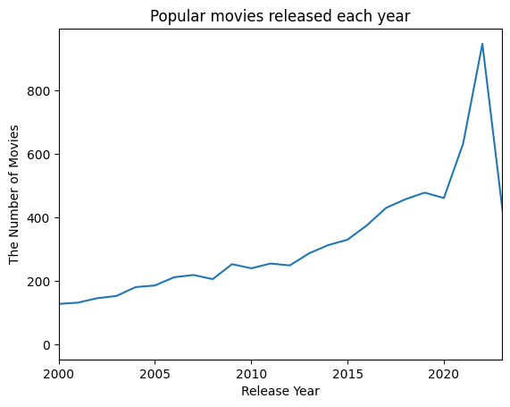
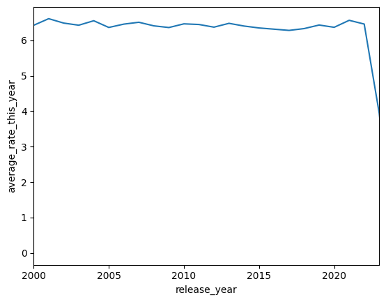

## Movies Data Analysis
In this project, I practiced using Pandas and its popular _groupby_ function. Understanding how it works and how to use it is crucial for data manipulation. This is why, after taking a look at the data, I came up with five questions that required me to drop missing values, convert data from _object_ to _int_, and apply the _groupby_ function to different features. This exercise helped me feel more confident when working with and visualizing datasets.

After importing the necessary libraries for the analysis and reading the _CSV_ file, I started by exploring how the data looks in general, identifying columns with missing values, and determining the data types of these columns. The columns with an _object_ datatype are considered categorical, so I checked how many categories they have. The code snippet below illustrates the process:
>```Python
>movies_data.head()
>```
>|title|release_date|genres|original_language|vote_average|
>|:----|:-----------|:-----|:----------------|:-----------|
>|The Pope's Exorcist|2023-04-05|['Horror', 'Mystery', 'Thriller']|English|7.4|
>|Ant-Man and the Wasp: Quantumania|2023-02-15|['Action', 'Adventure', 'Science Fiction']|English|6.6|
>|The Super Mario Bros. Movie|2023-04-05|['Animation', 'Adventure', 'Family', 'Fantasy']|English|7.5|
>...

>```Python
>print(movies_data.shape)
>```
>(10000, 14)

>```Python
>print(movies_data.dtypes)
>```
>|id|int64|
>|:--|:---|
>|title|object|
>|release_date|object|
>|genres|object|
>|original_language|object|
>|vote_average|float64|
>|vote_count|int64|
>...

>```Python
>print(movies_data.select_dtypes(["object"]).nunique())
>```
>|title |                  9650|
>|:------|:-------|
>|release_date  |          5877|
>|genres  |                2323|
>|original_language   |      51|
>|overview     |           9916|
>|production_companies |   7990|
>|tagline       |          7189|

>```Python
>movies_data.isnull().sum()
>```
>|id |                        0|
>|:--------|:----------|
>|title           |           0|
>|release_date        |      21|
>|genres     |                0|
>|original_language       |   0|
>...

The provided information gave me an understanding of how to address the first question: __How many movies were released each year after the year 1999?__
```Python
movies_data_no_mis_val_year = movies_data.dropna(subset="release_date")
movies_data_no_mis_val_year["release_year"] = movies_data_no_mis_val_year["release_date"].str.split("-").str[0].astype('int')

movies_data_no_mis_val_year["movies_each_year"] = movies_data_no_mis_val_year.groupby("release_year")["id"].transform('count')
unique_year_movies = movies_data_no_mis_val_year.drop_duplicates(subset="release_year")
unique_year_movies = unique_year_movies[unique_year_movies["release_year"] >= 2000]
unique_year_movies = unique_year_movies.sort_values(by="release_year", ascending=False)
print(unique_year_movies[["release_year", "movies_each_year"]])
```
I used the Seaborn library along with its _lineplot_ function to visualize the dynamics:
```Python
sns.lineplot(data=unique_year_movies, x = "release_year", y = "movies_each_year")
plt.xlim(2000, 2023)
plt.title("Popular movies released each year")
plt.xlabel("Release Year")
plt.ylabel("The Number of Movies")
plt.show()
```


__What was the average voting rate for movies each year?__
```Python
average_rate_each_year = movies_data.copy()
average_rate_each_year = average_rate_each_year.dropna(subset="release_date")
average_rate_each_year["release_year"] = average_rate_each_year["release_date"].str.split("-").str[0].astype('int')
average_rate_each_year["average_rate_this_year"] = average_rate_each_year.groupby("release_year")["vote_average"].transform('mean')

unique_average_rate = average_rate_each_year.drop_duplicates(subset="release_year")
unique_average_rate = unique_average_rate.sort_values(by="release_year", ascending=False)
unique_average_rate = unique_average_rate[unique_average_rate["release_year"] >= 2000]
print(unique_average_rate[["release_year", "average_rate_this_year"]])
```
To comprehend the trend, I visualized the outcomes:
```Python
sns.lineplot(data=unique_average_rate, x = "release_year", y = "average_rate_this_year")
plt.title("Movie's aberage rate each year")
plt.xlabel("Release Year")
plt.ylabel("Avyrage Rate")
plt.xlim(2000, 2023)
plt.show()
```


__Which movie had the highest voting rate each year, and what was its corresponding voting rate?__
```Python
best_movie = movies_data.copy()
best_movie["release_date"].isnull().sum()
best_movie = best_movie.dropna(subset="release_date")
best_movie["release_year"] = best_movie["release_date"].str.split("-").str[0].astype(int)
best_movie["best_title"] = best_movie.groupby("release_year")["vote_average"].transform('max')
best_movie = best_movie.drop_duplicates(subset="release_year")
best_movie = best_movie[best_movie["release_year"] >= 2000]
best_movie = best_movie.sort_values(by="release_year")
print(best_movie[["release_year", "title", "best_title"]])
```
__Which movie is the most popular across all languages?__
```Python
langugage_movie_data = movies_data.copy()
langugage_movie_data["most_popular"] = langugage_movie_data.groupby("original_language")["popularity"].transform("max")
langugage_movie_data = langugage_movie_data.drop_duplicates(subset="original_language")
print(langugage_movie_data[["title", "most_popular", "original_language"]])
```
__What were the budget and revenue figures for each of the popular movies?__
```Python
best_movie = movies_data.copy()
best_movie["release_date"].isnull().sum()
best_movie = best_movie.dropna(subset="release_date")
best_movie["release_year"] = best_movie["release_date"].str.split("-").str[0].astype(int)
best_movie["best_title"] = best_movie.groupby("release_year")["vote_average"].transform('max')
best_movie = best_movie.drop_duplicates(subset="release_year")
best_movie = best_movie[best_movie["release_year"] >= 2000]
best_movie = best_movie.sort_values(by="release_year")
print(best_movie[["release_year", "title", "budget", "revenue"]])
```
